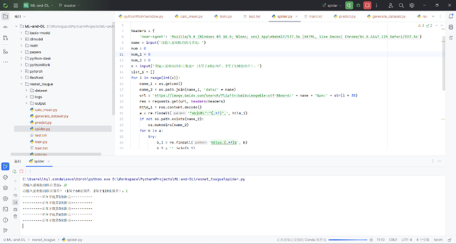
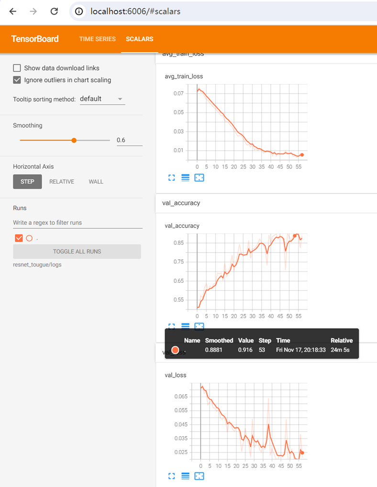
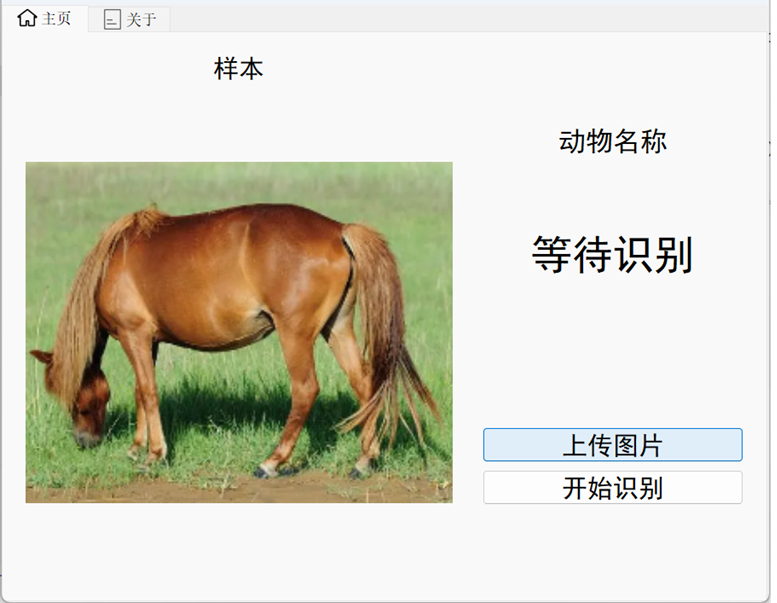
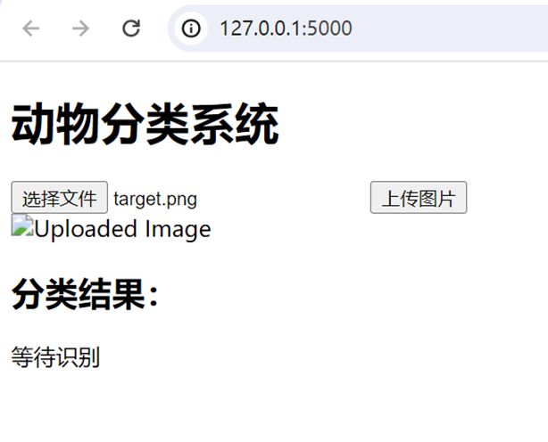
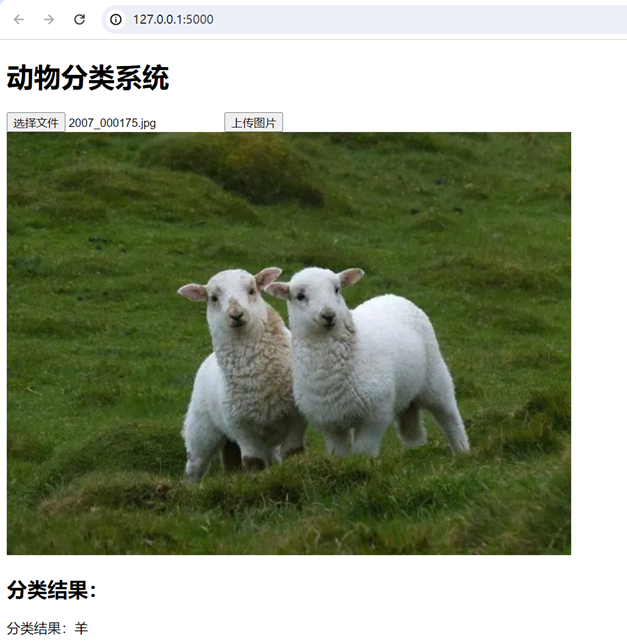

# pythonexp
## 基于resnet的动物图像分类系统（python期末大作业）PyQt+Flask+HTML5+PyTorch

## requirements
### python=3.7 torch flask tensorboard request pyqt5

# （一）需求和规格说明

**问题描述：**本系统是一款用于动物分类的图像识别系统，基于ResNet残差神经网络。用户可以通过输入关键词，利用爬虫从百度图片中获取相应的动物图像数据集。提供数据集的自动分割和标签加载功能。通过简单的GUI界面，用户可以上传一张图片，系统将自动调用模型进行预测，并在屏幕上显示该图片内动物的种类。

 

**编程任务：**

(1) 编写爬虫脚本，使得可以读取用户输入关键词去爬取下载相应图片数据集。

(2) 实现数据集的自动分割测试集和加载标签。

(3) 建立神经网络模型，编写训练脚本。

(4) 编写GUI界面，使得用户可以传入一张图片，程序需自动调用模型，预测图片类别并打印输出，分别使用PyQt和flask+h5编写本地客户端和网页端。

# （二）设计

## 1．设计思想

本题主要考察python爬虫知识和深度学习框架的熟练度，作为大作业的题目，该题可以很好体现python所具有的其他语言没有的软件生态。需要用到的爬虫操作需要用户输入一个关键词比如“猫”程序去百度图库搜索并下载对应图片。通过分割脚本整理数据集，然后训练模型保存到特定为止，编写一个简单的GUI，分别使用PyQt和flask+h5编写本地客户端和网页端，使得用户可以选择输入一个图片，并且由模型预测输出类别。

本系统采用了综合应用爬虫、深度学习和图形用户界面（GUI）技术，旨在为用户提供一个简便而有效的动物图像分类系统。整体设计思想围绕以下几个关键点展开：

\- **数据采集与处理：**

 \- 用户输入关键词后，系统利用爬虫技术从百度图片中获取相应的动物图像数据集。这一步骤涉及到异步网络请求、图片下载、数据清洗等操作，确保获得高质量的训练数据。

\- **深度学习模型：**

 \- 采用ResNet残差神经网络作为图像分类的核心模型。ResNet结构的特点在于可以很好的解决梯度消失或者爆炸、退化问题，提高了模型的准确性。

\- **模型训练脚本：**

 \- 系统提供了模型的训练脚本，用户可以选择自行训练模型以满足特定需求。模型训练过程中，采用了学习率调整和参数初始化等技术，以提高训练效果。

\- **用户交互界面：**

 \- 使用PyQt5库创建简单的图形用户界面，使用户能够轻松上传图片、调用模型进行预测并查看结果。GUI设计注重用户友好性和易用性，以提升系统的使用体验。

\- 为了方便快捷，还使用了flask+HTML5部署了网页端，使得随时随地从公网访问服务成为了可能

## 2. 设计表示代码结构： 

文件模块结构：

  |-- spider爬虫模块

​    |-- spider.py        # 用于爬取图片数据集的爬虫脚本

​      \# 该脚本定义了一个用于从百度图片搜索下载图片数据集的爬虫。用户可以输入关键词，脚本将在百度图片中搜索相关图片并下载保存。

 

  |-- 数据处理模块

​    |-- calc_mean.py      # 用于计算图片色素均值，用于归一化的脚本

​      \# 该脚本定义了一个用于计算图片色素均值的工具。色素均值对于训练深度学习模型时的数据预处理非常重要，用于归一化图像。

 

​    |-- generate_dataset.py   # 生成训练集和测试集的脚本

​      \# 该脚本用于将下载好的图片数据集分割为训练集和测试集，并生成对应的标签文件（train.txt 和 test.txt）。

 

  |-- 神经网络深度学习模块

​    |-- train.py         # ResNet模型的定义以及训练神经网络模型的脚本

​      \# 该文件定义了ResNet模型的结构，包括残差块（Residual Block）等。这是系统中用于图像分类任务的主要神经网络模型。该脚本还定义了一个用于训练ResNet模型的脚本。它加载数据集，训练神经网络，并保存训练好的模型权重。

 

​    |-- utils.py         # 数据加载和预处理的工具函数

​      \# 该文件包含了一些用于加载和预处理数据的工具函数，如LoadData类，用于加载图片数据集，并进行数据预处理。

 

  |-- pyqt可视化模块

​    |-- window.py        # 主窗口的GUI设计

​      \# 该文件定义了系统的主窗口GUI，用户可以通过该窗口上传一张图片，系统将自动调用模型进行预测，并在界面上显示预测结果。

 

​    |-- predict.py        # 预测图片类别的脚本

​      \# 该脚本定义了一个用于预测单张图片类别的函数。它加载训练好的ResNet模型，读取输入图片，进行预测，并返回预测结果。

 

  |-- images      # 用与存放pyqt的背景图像，和用户上传的临时图片

​    |-- logo.png         # 系统图标

​      \# 该文件是系统的图标，用于在窗口标题栏和任务栏中显示。

 

​    |-- horse.png        # 预测用的示例图片

​      \# 该文件是一个用于系统测试的示例图片，用户可以通过GUI上传其他图片进行测试。

  |-- templates 文件夹

​    |-- index.html       # 用于部署flask的h5页面代码

 

  |-- output 文件夹

​    |-- resnet18_e_best.pth   # 训练好的ResNet模型的权重

​      \# 该文件是经过训练得到的ResNet模型的权重文件，用于在GUI中加载预训练的模型。

 

  |-- dataset 文件夹

​    |-- class1 # 动物类别class

​      |-- image1.jpg

​      |-- image2.jpg

​      \# 该目录包含一个用于训练的数据集。用户可以将自己的数据集放在类似的目录结构下，通过增强数据集提高模型性能。

​    |-- class2

​      |-- image3.jpg

​      |-- image4.jpg

 

  |-- test.txt           # 测试集文件

​    \# 该文件是测试集的标签文件，记录了测试集中每张图片的路径和对应的类别。

 

  |-- train.txt           # 训练集文件

​    \# 该文件是训练集的标签文件，记录了训练集中每张图片的路径和对应的类别。

 

## 3. 核心算法

训练神经网络模型

训练神经网络的核心算法代码在 train.py 文件中。首先，通过 LoadData 类加载训练集和测试集。然后，使用 resnet18 作为基础模型，修改最后一层的全连接层，使其适应问题的输出类别。训练过程中，采用交叉熵损失函数和 Adam 优化器优化损失函数，使用tensorboard来查看训练过程。为了更好地调整学习率，对不同层次的参数采用不同的学习率，对最后一层。训练过程中，记录训练和验证的损失，并保存模型参数。

ResNet模型定义

ResNet 模型的定义在也在train.py 文件中。继承了 resnet18 预训练模型的参数，对其中的最后一层全连接层进行了修改，以适应特定问题的输出类别。这个自定义的 ResNet 模型被用于训练和预测。

数据加载和预处理

数据加载和预处理的工具函数在 utils.py 文件中。LoadData 类负责加载训练集和测试集，该类继承自pytorch框架的dataset类，拥有父类的方法，可以同时进行图像的预处理，包括大小调整、随机翻转、标准化等操作。

图像预测

图像预测的核心算法在 predict.py 文件中。通过加载训练好的 ResNet 模型参数，读取用户输入的图片，进行与训练时相同的预处理操作，然后使用模型进行预测。最终输出预测的动物类别。

# （三）用户手册

本系统是一款基于 ResNet 的动物分类系统，旨在帮助用户通过上传图片实现对动物种类的识别。用户可以通过以下详细步骤使用该系统：

\1. 准备工作

在使用系统之前，请确保已经完成以下准备工作：

安装 Python 3.x

安装必要的 Python 库：PyTorch、torchvision、PIL、numpy、opencv-python、PyQt5

\2. 数据集准备

用户可以通过两种方式准备动物图片数据集：

手动准备数据集： 在 enhance_dataset 目录下，手动创建每个动物类别的文件夹，将对应类别的图片存放在相应文件夹中。例如：

├── dataset

  ├── cat

​    ├── cat1.jpg

​    ├── cat2.jpg

​    ├── ***.jpg……

  ├── dog

​    ├── dog1.jpg

​    ├── dog2.jpg

使用爬虫脚本获得数据集： 运行spider.py 脚本，根据提示输入百度搜索图片的关键词，系统将从百度图库上爬取相应图片数据集。请在下载完成后检查图片是否有无法显示的和损坏的，否则就会影响到后面的过程

\3. GUI主页面

样本显示： 在主页面中，默认显示一个示例图片，用于演示系统的功能。

上传图片： 点击“上传图片”按钮，选择本地图片文件进行上传。上传后系统会显示选择的图片。

开始识别： 点击“开始识别”按钮，系统使用训练好的模型对上传的图片进行动物分类，结果将在界面中显示。

\4. 网页主页面

选择文件： 点击“选择文件”按钮，选择本地图片文件进行上传。上传后系统会显示选择的图片路径。

上传图片： 点击“上传图片”按钮，系统会上传图片至服务器，系统后端使用训练好的模型对上传的图片进行动物分类，结果将在界面中显示。

\5. 退出系统

点击窗口右上角的关闭按钮，系统会询问用户是否要退出程序。选择“是”即可退出系统。

# （四）调试及测试

注意：1-2步为面向开发者用户，可以自行训练模型，探索系统，3-4步为面向普通用户，使用系统提供的模型，仅体验系统功能

## 1. 测试爬虫：

运行spider.py

然后输入猫

然后输入页数1，由于百度图库的原因，一页只能下载最多60张图片，不能持续爬取。

可以看到成功下载到了猫的数据集。

## 2. 测试模型训练：

第一步运行generate_dataset.py，可以看到生成了两个txt文件：train.txt,test.txt

运行train.py

可以看到模型开始训练，如果有显卡的用户等待大概20分钟左右，可以在命令行下输入

tensorboard –logdir=./logs

然后浏览器打开localhost:6000页面查看训练日志

这里可以看到准确率已经非常可观了，我们可以使用了。

 

## 3.PyQt客户端GUI使用

运行window.py

可以看到弹出的pyqt窗口

 

这只马的图像是我从网上随便找的一张，并不是训练集中的，用于测试使用，我们也可以选择上传一个图片选择上传图片后，程序会把选择的图片复制到image/tmp_up.jpg下面，然后并预测结果，显示在界面中，如图

 

## 4.flask部署网页端UI使用

运行myflask.py，部署flask（可部署云服务器）

访问本地127.0.0.1:5000端口，进入index.html的表单页面，如图

 

单击选择文件，选择一个图片然后上传

分类结果会显示在下方

